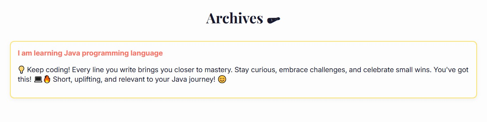

# CheerUp 🎉📰

[](#tech-stack)

CheerUp turns everyday "small wins" into playful, newspaper-style headlines so you can celebrate, remember, and share the little victories. ✨

Why use it?
- ✨ Turn mundane moments into memorable headlines
- 📝 Keep a light, positive daily journal
- 📤 Share highlights with friends or revisit when you need a mood boost

---

## Key Features 🚀
- 📰 Headline generator — Convert short text into creative, newspaper-style titles  
- 💾 Daily journal — Save and browse previous headlines  
- 📱 Responsive front-end — Mobile & desktop friendly  
- 🔧 Extensible backend — Node + Express API for integrations  

---

## Demo 🎯
Input: "I organized my desk"  
Output: "Local Organizer Restores Order, Desk Productivity Soars"  

**📸 Screenshots:**  
 

---

## Quick Start ⚡️

1. Clone
```bash
git clone https://github.com/your-username/cheerup.git
cd cheerup
```

2. Install
```bash
npm install
```

3. Configure
Create a `.env` file in the project root:
```env
PORT=3000
HUGGINGFACE_API_KEY=your_huggingface_api_key_here
```
Replace HUGGINGFACE_API_KEY with your AI provider key.

4. Run
```bash
npm start
```
Open http://localhost:3000

---

## API (example) 🛠️
POST /api/generate

Request:
```json
{
  "text": "I cooked dinner today",
  "tone": "playful"
}
```

Response:
```json
{
  "headline": "Local Chef Whips Up Culinary Masterpiece",
  "source": "model:v1"
}
```

Example curl:
```bash
curl -X POST http://localhost:3000/api/generate \
  -H "Content-Type: application/json" \
  -d '{"text":"I ran 5km today","tone":"energetic"}'
```

---

## Tech Stack 🧩
- Frontend: HTML, CSS, JavaScript  
- Backend: Node.js, Express  
- AI: Hugging Face (or configurable provider)

---

## Project Structure 📁
```
cheerup/
├── index.html
├── style.css
├── app.js
├── api/
│   ├── server.js
│   ├── controller/
│   ├── routes/
│   └── utils/
├── screenshots/
├── package.json
└── README.md
```

---

## Development Tips 💡
- Prompt examples: "Write a playful newspaper headline: {text}"  
- Rate-limit or cache AI calls to control cost.  
- Mock external API calls in unit tests for reliability.

---

## Contributing 🤝
Contributions welcome — open issues or PRs.

Workflow:
```bash
git checkout -b feature/your-feature
# make changes
git commit -m "Add feature"
git push origin feature/your-feature
```
Please include tests for new features and follow standard PR conventions.

---
